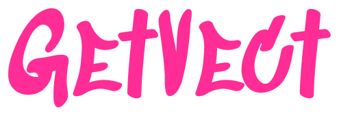
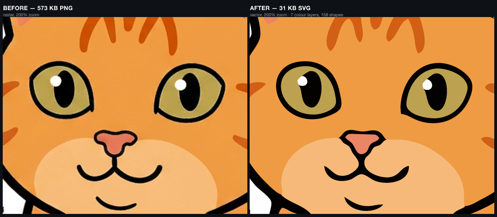
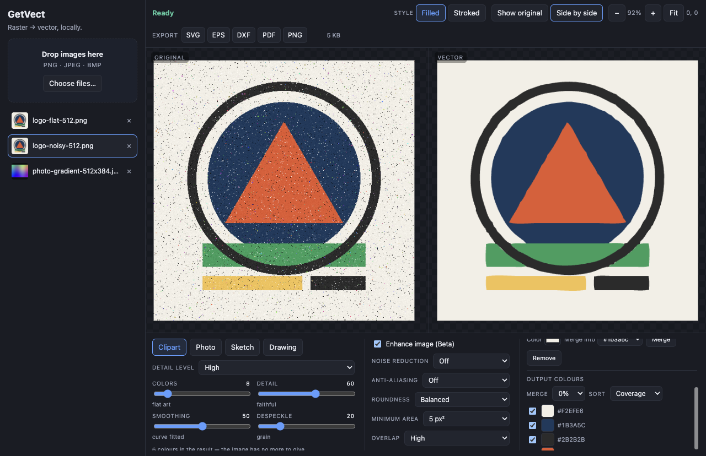
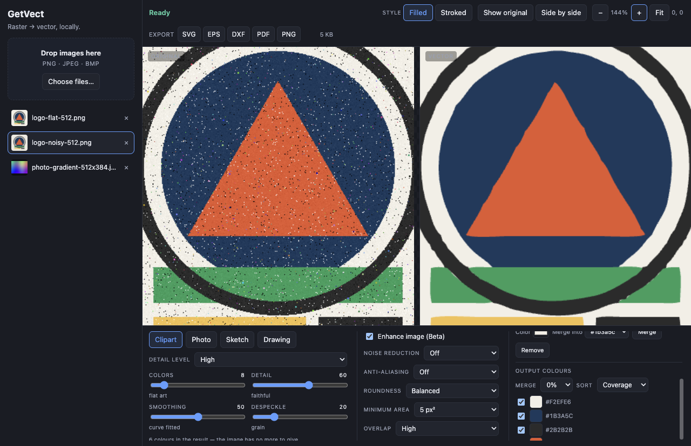
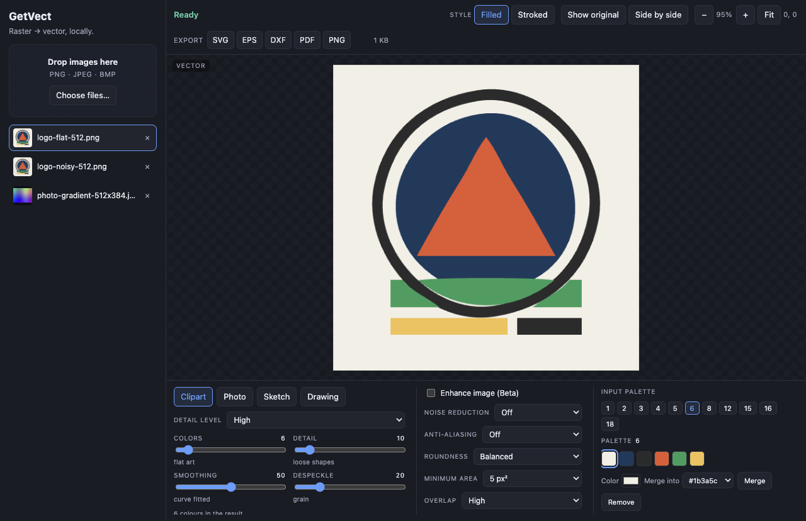

<div align="center">




<br>

**Raster → vector, on your machine.**

Drop in a PNG, JPEG or BMP. Get back SVG, EPS, DXF, PDF or PNG.
No account, no credits, no subscription. Offline by default.

[](https://github.com/craigjmidwinter/getvect/actions/workflows/ci.yml)
[](./LICENSE)


</div>

---

Every good online vectorizer wants your image on their server and your card on file — a
credit per conversion, a watermark until you pay, a queue when they're busy. GetVect is
the same job as a desktop app: a local Electron program with an offline tracing engine,
a full control surface for palette / detail / smoothing / speck removal, and native
save dialogs. There is no per-image cost and nothing to sign up for.

**Ingest, tracing, preview and every export run offline**, with the renderer under a
`default-src 'self'` CSP and no network calls at all. There is exactly one exception, and
it is worth naming rather than burying: optional
[AI Enhance](#ai-enhance-optional-bring-your-own-key) sends the image you are working on
to Google under your own API key. It ships off, it needs a key you supply, and the switch
says what it does before you flip it. Leave it off and nothing ever leaves the machine.

The quality bar is explicit and adversarial: [the reference product](https://the reference product)'s
own output on the same source images is checked into `fixtures/reference/` and the test
harness measures us against it on every run — including where it wins.

## Before / after



Frankie is our mascot and our demo fixture. Traced at 8 colours with Smart anti-aliasing,
a 568 KB raster becomes a **19 KB SVG in 7 colour layers and 59 shapes** — curve-fitted
outlines, transparent background preserved, and infinitely re-scalable. The same source
through the real the reference product comes back 21.7 KB in 40 paths: **fewer shapes than ours,
in more bytes**, at settings where their Enhance is a generative flatten and ours is
switched off. Both halves of that are checked in and measured on every run, so they are
reported here the same way they would be if they went the other way. The full output is
[`docs/assets/frankie-vector.svg`](docs/assets/frankie-vector.svg); the source and the
reference exemplar live in [`fixtures/reference/`](fixtures/reference/).

## The app



<details>
<summary>More screenshots</summary>

Synchronised zoom across both panes — the speckle on the left is gone from the trace on
the right, and the edges stay crisp at any magnification:



Candidate palettes at eleven fixed sizes, plus a palette editor that can recolour, merge
and remove individual swatches:



</details>

## What it does

Grounded in [REFERENCE.md](./REFERENCE.md), which is the spec the whole project is graded
against. Every item below has an acceptance spec in [`tests/e2e/`](tests/e2e/).

**Ingest** — drag-and-drop or file picker; PNG, JPEG and BMP; unsupported files rejected
with a real message; multiple images in a sidebar you can switch between.

**Vectorization** — auto-traces on load with visible progress, off the UI thread.
- Four model presets: **Clipart** (with seven detail levels), **Photo**, **Sketch**
  (grayscale), **Drawing** (black/white with a luminance threshold).
- **Input palette**: auto-generated candidate palettes at 1–18 colours as selectable rows,
  plus a custom palette editor (change a colour, merge two, remove one).
- **Output colour groups**: per-colour disable — switch off the background colour and you
  get a transparent background — with a merge threshold and sort order.
- **Quality**: Enhance (denoise + colour simplification), Noise Reduction off/low/high,
  Anti-aliasing off/smart/mid — Smart is the default, as it is in the real product, and it
  is worth 1747 sub-paths → 551 and 396 KB → 140 KB on the gold-standard artwork.
- **Advanced**: Roundness (3 curve-fitting levels), Minimum Area (0/5/90 px² speck
  removal), Overlap, Circle Detection.
- **Result style**: filled layers or stroked layers.

**Preview** — original/vector toggle and side-by-side, zoom in/out/fit and pan
synchronised across both panes. The preview *is* the SVG that gets exported, not a
re-render of it.

**Export** — SVG, EPS, DXF, PDF and PNG through the native save dialog, with per-colour
`<g fill="rgb(...)">` layers in the SVG so the result drops into Illustrator or Inkscape
as editable colour groups. The DXF keeps its curves: every fitted cubic travels as a
degree-3 `SPLINE`, so a CAD or cutter file is a drawing rather than a point cloud — and
the **Splines / Lines** picker beside the DXF button flattens it to R12 POLYLINE for the
older CAD and cutter firmware that cannot read a spline at all.

## AI Enhance (optional, bring your own key)

Off by default, and the only thing in GetVect that can touch the network.

The real the reference product's "Enhance with AI" turned out not to be a filter at all: it is a
generative image-to-image **re-illustration** — background removed, soft shading flattened
into bands, outlines regularized — after which the tracer is tracing already-flat art. That
is most of its advantage on shaded artwork, and no amount of median filtering reproduces
it. GetVect can now do the same step by asking an image model for it: paste your own
Google Gemini API key, switch AI Enhance on, and the enhanced image becomes the working
image the engine traces (at the model's own resolution, which is what the real product
does too). One call, ~8s on a 1024px source in our measurements.

**The trade, stated plainly.** With AI Enhance on, *that image is uploaded to Google* under
your own API key and their terms — which is exactly the thing the rest of this app exists
to avoid. Nothing else changes: no other image, no other feature, no telemetry, and the
switch is off until you turn it on. The key is encrypted at rest with Electron's
`safeStorage` (Keychain on macOS) inside the app's data directory, lives only in the main
process, and is never returned to the UI — the interface can save one, clear one, and ask
whether one exists. If the OS has no keystore available, GetVect refuses to store the key
rather than writing it in the clear. If a run fails — bad key, no network, 60s timeout — the
un-enhanced image is traced instead and the app says why.

The fully-local version of this (background removal, then an on-device generative flatten,
with nothing leaving the machine) is the plan of record:
**[issue #1](https://github.com/craigjmidwinter/getvect/issues/1)**. The provider layer was
written for it — a local backend is meant to arrive as one more `EnhanceProvider`, not as a
second pipeline.

**Not built** (REFERENCE section E, deliberately out of scope for now): isometric layer
view, crop, pixel editing, gradient detection, drag-to-regroup colour circles, Android
VectorDrawable / STL / GCODE export, ZIP variants. Accounts, credits and a web API are
out of scope permanently — that's the point.

## Quick start

Requires Node 20+ and, for now, macOS.

```bash
git clone https://github.com/craigjmidwinter/getvect.git
cd getvect
npm install     # postinstall also de-quarantines + ad-hoc-signs the Electron binary
npm start       # build + launch
npm run dist    # package the app -> release/mac-arm64/GetVect.app (+ dmg, zip)
```

`npm run dist` builds **unsigned** — see [PUBLISH-CHECKLIST.md](./PUBLISH-CHECKLIST.md)
for the signing and notarization notes; the packaging config itself is
[`electron-builder.yml`](./electron-builder.yml).

> **macOS note.** On recent macOS, Gatekeeper/XProtect deletes the freshly-extracted,
> unsigned `node_modules/electron/dist/Electron.app` the first time you exec it — the
> symptom is `spawn .../Electron ENOENT` on a file that was there a second ago. The
> `postinstall` hook ([`scripts/verify-electron.mjs`](scripts/verify-electron.mjs))
> detects this, strips the quarantine xattrs and applies an ad-hoc signature. If you ever
> see that ENOENT, run `npm run postinstall`.

## Testing & instruments

```bash
npm test              # engine contract tests, then the Playwright acceptance suite
npm run test:engine   # just the engine contracts (pure Node, no Electron)
npm run instruments   # fidelity metrics -> artifacts/metrics.json
npm run screenshots   # a labelled contact sheet of the whole flow -> artifacts/screenshots/
npm run docs:screenshots # regenerate the three screenshots this README shows
```

Three layers, and they are the project's real documentation:

- **Acceptance suite** — Playwright driving the *packaged* Electron app, one spec file per
  REFERENCE checklist section, every test title prefixed with its id (`[A1]`…`[D5]`).
  Selectors are `data-testid` only; the DOM contract is [docs/TESTIDS.md](docs/TESTIDS.md).
- **Engine contracts** — `node --test` over the pure tracing engine: determinism, setting
  semantics, SVG/EPS/DXF/PDF structure, alpha handling, and rasterized checks that the
  *picture* actually changed.
- **Instruments** — the light meter. For every fixture it runs `vectorize()`, rasterizes
  the SVG back to source dimensions with resvg and diffs: mean colour error, SSIM, ink
  recall, sub-path count, tiny-speck ratio, curve-command ratio, transparent-area colour
  error, and ratios against the real the reference product exemplar. REFERENCE's "blind A/B"
  turned into numbers that can fail a build.

Full guide, metric definitions and the engine interface contract:
**[docs/HARNESS.md](docs/HARNESS.md)**.

## How it was built

GetVect was written almost entirely by a **pit crew gauntlet** — a multi-agent loop where
three roles take turns on one repo. *Builders* implement a slice at a time (engine →
shell → settings → export). *Critics* start with fresh context, read only the spec and the
running app, and score it. And a *pit crew* does nothing but build measurement: the
Playwright-for-Electron harness, the fixture generator, the fidelity instruments. The bet
being tested is the thesis that a loop's speed limit is measurement, not intelligence — so
a third role that only makes things countable should pay for itself.

The single biggest correction came from refusing to grade against adjectives. The original
bar was written from marketing copy, and "matches the reference product" doesn't fail CI. So the
real product got driven live in a browser, its `#outputsvg` DOM read at a dozen settings
combinations, and its actual outputs checked into `fixtures/reference/` as exemplars with
fully-known parameters. That recon rewrote the spec — the product thinks in *model presets
and candidate palettes*, not the detail/smoothing/despeckle sliders we'd guessed — and it
surfaced the finding the engine now revolves around: **Smart anti-aliasing collapses path
count by ~81–95% at otherwise identical settings**, now replicated on three subjects
(354 → 67, 637 → 63 on the fox, 758 → 41 on Frankie). That is a pre-trace edge cleanup,
not a rendering garnish, and it is the difference between output that looks *traced* and
output that looks *drawn*.

The loop also caught itself cheating. For an entire lap the instruments fed the engine a
white-flattened image that no UI could ever produce, while the renderer's canvas ingest
was handing it `(0,0,0,0)` for transparent pixels — so every transparent-background PNG,
the whole sticker/decal use case, traced an invented opaque black background and scored
*green*. A number measured on pixels the product never sees is not a measurement of the
product. There is now a decode-parity spec whose only job is to go red the moment the app
and the harness disagree.

The whole build is chronicled as it happened in [`katra/entries/`](katra/entries/) —
[the loop design](katra/entries/2026-08-04-a-pit-crew-gauntlet-takes-on-vectorizer-io.md)
and
[the ground-truth recon](katra/entries/2026-08-04-driving-the-real-vectorizer-for-ground-truth-smart-aa-is-the-whole-ballgame.md).
Longer-form writing on the loop itself lives at
[craigmidwinter.com](https://craigmidwinter.com).

## Layout

```
src/main/        Electron main process + preload bridge
src/renderer/    React UI (workspace, preview, settings) + vectorization worker
src/engine/      pure vectorization engine (palette / trace / curve fit / SVG / EPS / DXF / PDF)
src/shared/      testid constants shared by app and tests
tests/e2e/       Playwright acceptance suite, one spec per checklist section
tests/engine/    engine contract tests (node --test)
instruments/     fidelity metrics + screenshot harness
fixtures/        deterministic test images (npm run fixtures) + real-product exemplars
scripts/         build/dev/fixture/postinstall tooling
artifacts/       generated output (git-ignored)
```

The engine (`src/engine/`) is a **pure module** — no Electron, no DOM, no `fs`, no network
— because the renderer runs it in a worker and the instruments import it straight from
Node. That constraint is what makes the whole measurement story possible.

## Contributing

See [CONTRIBUTING.md](./CONTRIBUTING.md). Short version: the suite must be green where it
was green, the instruments must not regress, and any new UI has to declare its testids in
[docs/TESTIDS.md](docs/TESTIDS.md).

## Status

Pre-1.0 and honest about it. The acceptance suite is the source of truth for what works
today — run `npm test` and read the summary. macOS is the only platform currently
exercised; Linux needs `xvfb-run -a` for the Electron tests and Windows is untested.

## License & credits

[MIT](./LICENSE) © 2026 Craig Midwinter.

Tracing builds on [imagetracerjs](https://github.com/jankovicsandras/imagetracerjs)
(Unlicense) for boundary extraction; curve fitting, colour handling and every exporter are
this project's own. The test harness uses [sharp](https://github.com/lovell/sharp) and
[resvg-js](https://github.com/yisibl/resvg-js). The mascot is **Frankie**, an orange tabby
— the maintainer's own cat; the artwork was generated with an image model from a photo of
him and then hand-corrected for coat colour and markings, and it is MIT-licensed along
with the rest of the repo. The fox he replaced is still in
[`fixtures/reference/`](fixtures/reference/), still license-clean, and still measured. The
wordmark is set in [Sedgwick Ave Display](https://fonts.google.com/specimen/Sedgwick+Ave+Display)
(SIL Open Font License), shipped as converted outlines in `docs/assets/getvect-wordmark.svg`.
